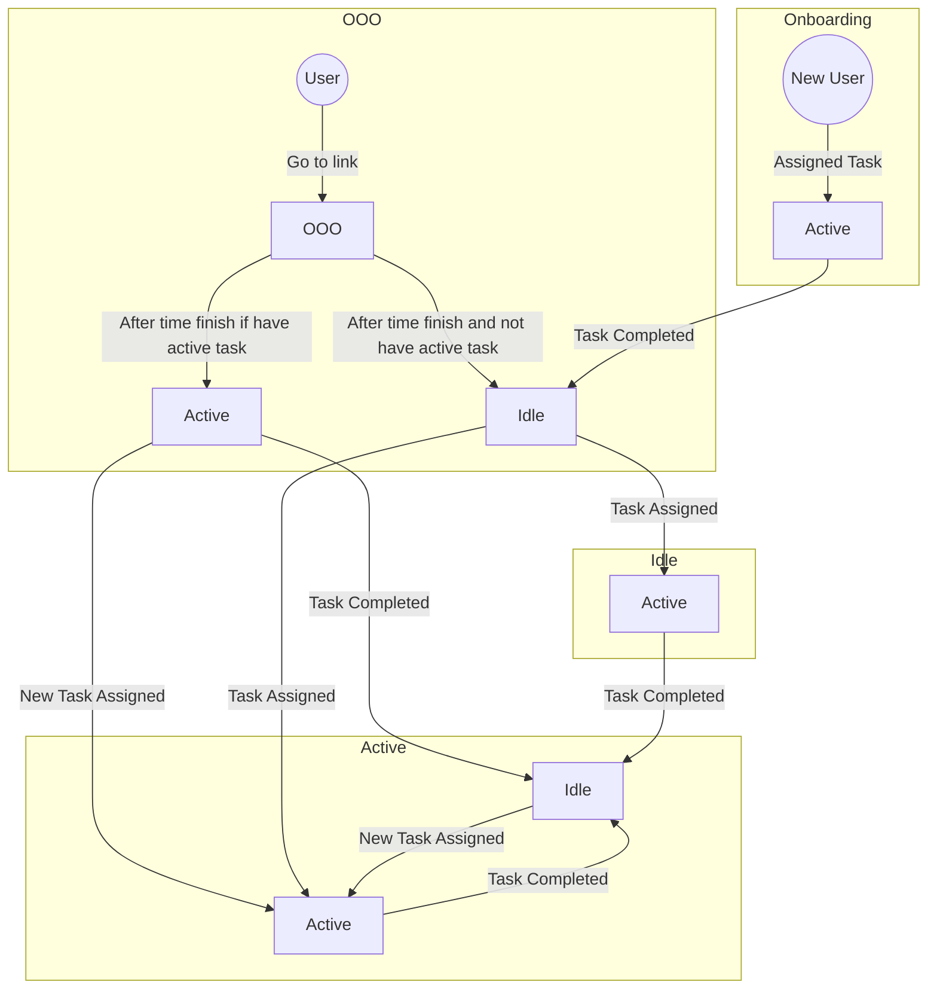

# User Status Flow Diagram Explanation

## Overview

This document provides an explanation for the flow diagram representing the user status implementation in the system. The diagram captures the transitions between different user states: Onboarding, Out of Office (OOO), Active, and Idle.

## User States

### Onboarding

- **New User:** Initially user status is "Onboarding" when they create an account.
- **Transition to Active:** The user transitions to the "Active" state when they are assigned a task during the onboarding process.

### OOO (Out of Office)

- **Change Status to OOO:** If user want to change their status to OOO, they can go to the `https://my.realdevsquad.com` link and change their status to OOO.
- **Transition to Idle:** If the user is in the "OOO" state and does not have an active task after a specified time, they transition to the "Idle" state.
- **Transition to Active:** If the user is in the "OOO" state and has an active task after a specified time, they transition to the "Active" state.

### Active

- **Transition to Idle:** If the user is in the "Active" state and completes their task, they transition to the "Idle" state.
- **Transition to Active:** If the user is in the "Active" state and receives a new task, they remain in the "Active" state.
- **Transition to OOO:** If the user is in the "Active" state and changes their status to OOO, they transition to the "OOO" state.

### Idle

- **Transition to Active:** If the user is in the "Idle" state and receives a new task, they transition to the "Active" state.
- **Transition to OOO:** If the user is in the "Idle" state and changes their status to OOO, they transition to the "OOO" state.

## Flow Diagram - User Status

## Conclusion

The user status flow diagram captures the transitions between different user states: Onboarding, Out of Office (OOO), Active, and Idle. The diagram also captures the transitions between these states. The diagram is useful for understanding how the user status implementation works in the system.
